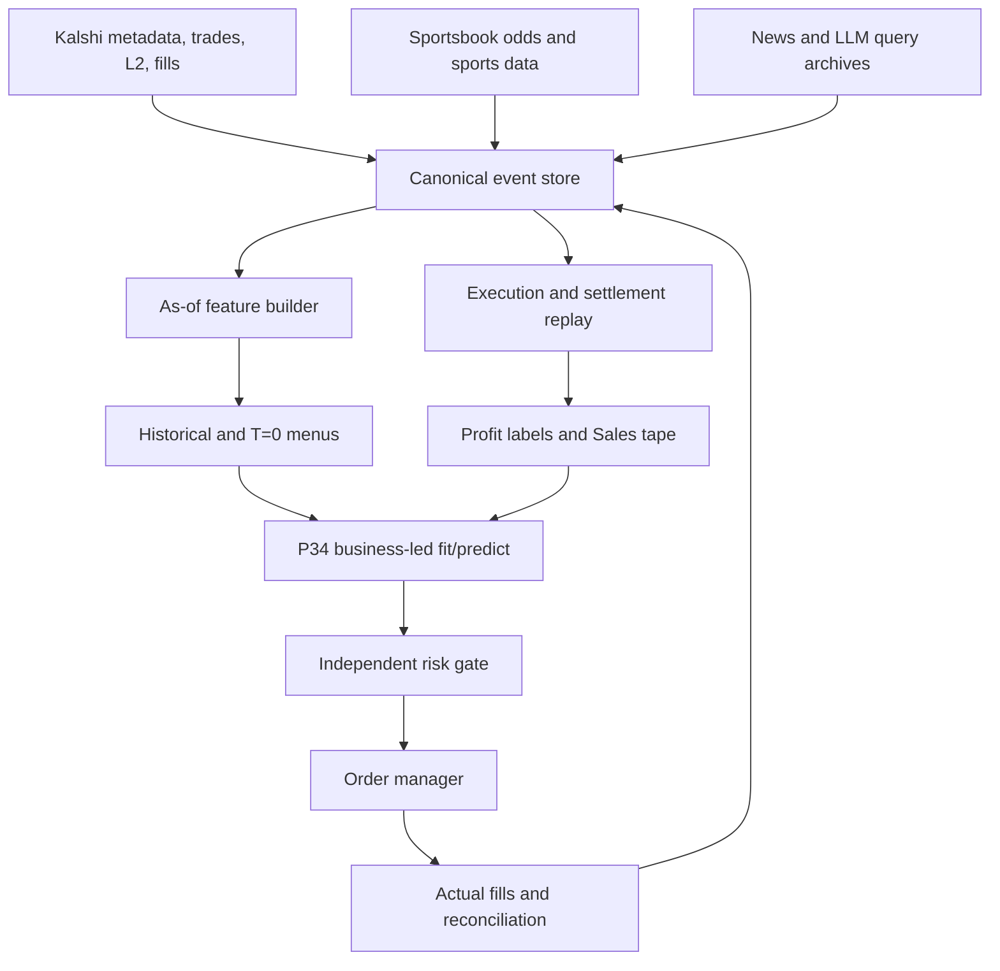

# Implementing a P34-Run Kalshi Sports Event-Contract Business

## A technical and research thesis on data, replay, model grounding, execution, and feasibility

**Status date:** 31 August 2026  
**Scope:** Research design for a properly authorized entity; not legal advice, not a resale-data business, and not a claim that the present public P34 service already supports prediction-market submissions.

---

## Abstract

This thesis asks whether a sports event-contract business operating on Kalshi could, in principle, be implemented with HyperC's P34 system. The answer is **yes for a constrained strategy class**, and **only approximately for more execution-sensitive strategies**.

The strongest initial design is a business that:

- evaluates Kalshi sports markets at fixed pre-event decision times;
- treats the YES side, NO side, and several position sizes as mutually exclusive menu alternatives;
- enters only small, immediately marketable positions whose full quantity is supported by archived or live order-book depth;
- holds the position to settlement;
- calculates profit from entry fills, fees, settlement, and any scalar or exceptional resolution rule;
- leaves `profit` blank whenever execution or economics cannot be reconstructed reliably; and
- supplies P34 with many historical menus, an economically reconcilable Sales tape, and strictly time-valid predictive features.

Under that boundary, historical market definitions, trades, results, sportsbook odds, and—increasingly—historical Level-2 order books can be acquired retrospectively. Exact counterfactual execution is still impossible for passive orders, large orders, and strategies whose hypothetical actions would have altered the book. These are limitations of counterfactual market replay, not deficiencies unique to P34.

This thesis adopts the user's requested research interpretation of `historically_chosen`:

> `historically_chosen = 1` is a mutex over the complete side-and-quantity alternative. It is set on exactly one row only when that row has a known or sufficiently reliable historical profit. Unlabeled groups do not need an invented “would-have-chosen” row.

That interpretation is coherent for this research experiment, but it differs from the current public P34 documentation, which says that declined groups require a flagged would-have-chosen row and that groups with no chosen row are dropped. The thesis therefore treats **retention of all-zero unlabeled groups as a P34 integration gate that must be tested or enabled**, rather than silently inventing a historical policy.

The conclusion is not that P34 guarantees a profitable business. It is that the proposed system can create a technically honest experiment capable of determining whether P34 adds out-of-sample economic value for a narrow, executable Kalshi sports strategy.

---

## 1. Research question and conclusion

### 1.1 Research question

Can a properly authorized entity use P34 to choose among Kalshi sports positions—direction, price, and quantity—using historical menus, predictive signals, and replayed economic outcomes?

### 1.2 Short answer

Yes, if the first experiment is limited to small taker entries held to settlement and if P34 accepts the agreed encoding of unlabeled groups.

The project becomes less exact as it moves away from that core:

| Strategy | Technical replay feasibility | Main limitation |
|---|---:|---|
| Small immediate taker entry, hold to settlement | High | Snapshot freshness and fee/rule reconstruction |
| Taker entry and deterministic early taker exit | Medium to high | Dense sequential L2 data and residual-position handling |
| Time-sliced liquidation | Medium | Avoiding reuse of the same liquidity; path dependence |
| Passive maker entry or exit | Low to medium | Counterfactual queue priority is unknown |
| Multi-leg arbitrage | Medium to low | Simultaneous leg execution and orphan-leg risk |
| Large orders | Low | Market impact and participant reaction are unknowable |
| Latency/news reaction strategy | Low | Precise information-arrival and matching-engine ordering |

### 1.3 What “implemented” means here

Implementation has four distinct levels:

1. **Dataset feasibility:** the historical inputs can be assembled without look-ahead leakage.
2. **Economic replay feasibility:** the chosen historical row can be assigned a defensible total-profit label and a matching Sales tape.
3. **P34 fit feasibility:** P34 accepts the menu structure, grounding mode, quantity mutex, labels, and unlabeled context.
4. **Operational feasibility:** a live system can construct a T=0 menu, obtain a P34 choice, pass independent risk controls, submit orders, and record actual fills.

The experiment succeeds only if all four layers work. A profitable spreadsheet backtest with fictional fills is not an implementation.

---

## 2. Explicit assumptions

### 2.1 Regulatory and contractual assumption

The entity is assumed to have every regulatory registration, jurisdictional permission, exchange approval, corporate authorization, data license, and third-party data right needed for the proposed research and any eventual trading. This removes legal eligibility from the research question; it does not eliminate the need to verify that those permissions actually cover API storage, model use, automated execution, and any external data feed.

Kalshi's published Developer Agreement presently limits API use to facilitating a member's own trading and restricts other storage or sharing without written authorization. Its separate website Data Terms restrict scraping, archival compilation, and machine-learning use without permission. Those restrictions do not defeat the thesis because permission is assumed, but they must appear on the production readiness checklist. See the [Kalshi Developer Agreement](https://assets.kalshi.com/Kalshi-Developer-Agreement.pdf) and [Kalshi Data Terms of Use](https://kalshi-public-docs.s3.amazonaws.com/kalshi-data-terms-of-service.pdf).

### 2.2 P34 interpretation adopted for the experiment

This thesis assumes that the P34 documentation's “would-have-chosen” requirement is erroneous or can be disabled for this adapter.

For every historical `(menu, key)` group:

- rows enumerate mutually exclusive side-and-quantity alternatives;
- at most one row has `historically_chosen = 1`;
- that row is the one selected for labeling;
- it receives `profit` only if the economic result is known or research-grade replayable;
- all untaken quantities and the opposite side have `historically_chosen = 0` and blank `profit`; and
- a completely unlabeled group may contain only zeros in `historically_chosen`.

The [current public P34 data-format document](https://github.com/hyperc-ai/P34-API-DOCS/blob/main/docs/03-data-format.md) states the opposite for declined groups: it instructs users to flag a would-have-taken quantity and says a group with no chosen row is dropped. It also reports a fit-time requirement for unlabeled business-menu rows. Therefore, the adopted interpretation is not merely a documentation style choice; it implies one of the following must be true:

1. the running P34 service already behaves differently from the public text;
2. HyperC enables a business-led adapter that retains all-zero unlabeled groups;
3. HyperC changes the parser for this research; or
4. unlabeled groups are omitted, in which case they do not provide P34 with declined-context information.

The thesis proceeds under options 1–3. A parser acceptance test is a hard Phase 0 gate.

### 2.3 Research labels may include high-confidence simulation

The project is a simulation of whether the business could operate. Therefore, `profit` may include:

- actual account fills and settlements; or
- a conservative counterfactual taker replay supported by contemporaneous L2 depth, a frozen execution rule, a complete resolution record, and a version-correct fee calculation.

Approximate maker fills, unsupported quantities, ambiguous contract matches, and incomplete liquidation paths remain unlabeled. They may contribute explicit feature columns such as `profit_simulated_approx`, but not the authoritative `profit` field.

### 2.4 Features need not be ground truth

P34 does not require feature columns to be facts or ground truth. Features may be noisy, estimated, model-generated, or ambiguous signals. P34's public documentation explicitly encourages many useful signals and multiple alternative translations of ambiguous features. The hard temporal rule is that every historical feature must be constructible from information available at that decision time.

---

## 3. The economic object being modeled

### 3.1 Kalshi contract mechanics

A standard binary event contract has YES and NO sides. The complementary sides sum economically to $1. A trader can enter, later close all or part of the position, or hold it to determination. The current order-book API exposes YES and NO bids; the complementary ask is inferred because a YES bid at (x) corresponds to a NO ask at (1-x). See Kalshi's [order-book explanation](https://docs.kalshi.com/getting_started/orderbook_responses) and [market order-book endpoint](https://docs.kalshi.com/api-reference/market/get-market-orderbook).

For a side purchased at effective entry cost (c), quantity (q), and terminal side value (s \in [0,1]), settlement-only profit is:

\[
\Pi = q s - q c - F_{entry}
\]

For an ordinary binary resolution, (s=1) for the winning side and (s=0) for the losing side. Some contracts or combinations can settle to a scalar value, so the implementation must read the market's actual rule and result rather than assuming every terminal value is exactly zero or one. Kalshi's current combo documentation, for example, describes scalar outcomes in some exceptional cases. See [Kalshi Combos](https://help.kalshi.com/en/articles/13823820-combos).

### 3.2 A trade requires a counterparty; a result does not

A market can settle even when a proposed position was never traded. This produces two distinct facts:

- **event result:** which side or scalar value was determined;
- **economic outcome:** the profit of a particular executable entry and exit.

A zero-volume or never-quoted position can have a known event result but no defensible economic profit. If no order matched, no position was created and no trading fee normally arose. The attempted trade's realized trading P&L is zero, but the profit of the nonexistent hypothetical position is unknown—not zero.

An archived executable quote creates a research exception. If a live L2 book showed enough offered quantity at the modeled decision time, a small immediate taker fill can be counterfactually replayed even if the historical tape shows no later public trade at the same moment. That result is simulated, not observed, and its label quality must be recorded.

### 3.3 Quantity is an action, not aggregate volume

Kalshi market `volume` is aggregate traded activity. P34 `qty` is the size of the contemplated position. These must not be conflated.

A quantity need not have appeared as a single historical trade to be replayable. If the contemporaneous book contained sufficient cumulative depth, the simulator can walk price levels and compute the quantity's volume-weighted entry price. If book depth is unavailable or insufficient, that quantity remains unavailable or unlabeled even if smaller quantities are replayable.

### 3.4 Early and partial exits

A Kalshi position can be closed fully or partially. A single order may fill immediately, fill at several price levels, fill over time, remain partially open, or fail to fill. Kalshi's FIX documentation reports cumulative quantity, remaining quantity, fill price, fee information, and partially filled status. See [Kalshi FIX order entry](https://docs.kalshi.com/fix/order-entry).

For a position with entry fills (i), exit fills (j), and residual quantity (q_r) settled at value (s):

\[
\Pi =
\sum_j q_j p^{exit}_j
+ q_r s
- \sum_i q_i p^{entry}_i
- \sum_i F^{entry}_i
- \sum_j F^{exit}_j.
\]

The system must retain every partial fill. Monthly summaries or a single average mark are inadequate when the objective is to reconcile a P34 Sales tape.

---

## 4. Mapping Kalshi into P34

### 4.1 Conceptual mapping

P34 is designed around menus of mutually exclusive acquisition quantities followed by a cash-return or liquidation tape. A prediction contract can be represented as a very short-lived inventory item:

| P34 concept | Kalshi interpretation |
|---|---|
| `key` | A unique market-decision instance, not merely a ticker |
| `menu` | One portfolio decision snapshot across eligible markets |
| `T` | Relative decision time; current task is 0, history is negative |
| `qty` | Contracts proposed for this side and execution style |
| `unit_cost` | Effective per-contract acquisition cost, including allocated entry fee |
| `unit_price` | Adapter's gross terminal sale/payout ceiling, normally 1.00 for the core strategy |
| `side` feature | YES or NO |
| `historically_available` | Whether this action was genuinely available under the replay protocol |
| `historically_chosen` | The one labeled side-and-quantity row under the adopted research convention |
| `profit` | Total economic profit for the chosen row, not per-contract return |
| Sales row | Early close fill, terminal cash payout, or other realized cash return |
| Unsold inventory/write-off | Losing residual position with zero terminal cash value |
| `unit_fee` | Per-unit exit fee assigned to the particular cash-return event |
| holding cost | Normally zero; optional explicit capital charge if consistently modeled |

### 4.2 Why the key must include decision time

P34's public contract says each historical key may appear in exactly one historical menu. A Kalshi ticker will be observed repeatedly, such as 24 hours, 6 hours, 1 hour, and 15 minutes before an event. The key must therefore be unique to the decision instance:

```text
KXNFLGAME-EXAMPLE@2026-09-01T17:00:00Z
KXNFLGAME-EXAMPLE@2026-09-01T22:00:00Z
```

The original ticker, event identity, team identities, league, market type, line, and scheduled start time remain separate feature columns so the model can learn across repeated structures.

### 4.3 Side and quantity mutex

Rows for YES, NO, and multiple quantities should share the same decision-instance key. The combination of side, quantity, and executable entry cost describes a complete alternative. Only one may be selected.

Example labeled group:

| key | side | qty | unit_cost | historically_chosen | profit |
|---|---|---:|---:|---:|---:|
| `GAME@T1` | YES | 1 | 0.431 | 0 | NaN |
| `GAME@T1` | YES | 10 | 0.438 | 1 | 5.62 |
| `GAME@T1` | YES | 25 | 0.447 | 0 | NaN |
| `GAME@T1` | NO | 1 | 0.581 | 0 | NaN |
| `GAME@T1` | NO | 10 | 0.589 | 0 | NaN |
| `GAME@T1` | NO | 25 | 0.603 | 0 | NaN |

Here, `unit_cost` includes the entry price and allocated entry fee. Only the complete `YES × 10` action is labeled. Other outcomes are not written into `profit` even if an analyst can calculate an ex-post counterfactual.

Example completely unlabeled group under the thesis assumption:

| key | side | qty | historically_chosen | profit | reason |
|---|---|---:|---:|---:|---|
| `GAME@T2` | YES | 1 | 0 | NaN | no executable ask |
| `GAME@T2` | YES | 10 | 0 | NaN | no executable ask |
| `GAME@T2` | NO | 1 | 0 | NaN | archive gap |
| `GAME@T2` | NO | 10 | 0 | NaN | archive gap |

This group is meaningful research context only if the P34 parser retains it.

### 4.4 `unit_cost`, fees, and reconciliation

The generic Sales schema has no separate entry-fee field. The cleanest adapter is:

\[
\text{unit\_cost}
= \text{entry VWAP}
+ \frac{\text{total entry fee}}{q}.
\]

Exit fees are distributed across Sales rows:

\[
\text{unit\_fee}_j = \frac{F^{exit}_j}{q_j}.
\]

This preserves the P34 identity between cash return and acquisition cost even when the exchange's fee calculation is nonlinear or rounded at the order/fill level. Fee rules must be versioned by date, series, market, maker/taker status, and any special schedule. Kalshi notes that fees can differ between markets and that maker fees arise only when a resting order executes. See [Kalshi Fees](https://help.kalshi.com/en/articles/13823805-fees).

### 4.5 Sales tape for hold-to-settlement

For a winning side held to settlement:

```csv
key,menu,T,qty,price,unit_fee,unit_holding_cost
GAME@T1,menu_20260901_1700,-1,10,1.00,0.00,0.00
```

For a losing side, the simplest generic replay is no cash-return row and a full write-off at the adapter's terminal horizon. If the adapter requires an explicit terminal event, it may instead record the complete quantity at price `0.00`, provided that P34's replay treats this identically and the reported `profit` reconciles exactly.

For early exits, each fill becomes its own Sales row with the actual or simulated fill time, quantity, price, and allocated fee. A residual position is later settled or written off.

### 4.6 Zero versus NaN

- `profit = 0` means the complete economic outcome was computable and actually zero.
- `profit = NaN` means the outcome could not be computed reliably, the position was not executable, the market has not resolved, or the replay is incomplete.

An unfilled order is not a zero-profit position label. It is an attempted action that created no position. Unless the research explicitly models order-attempt cost, its hypothetical position profit remains NaN.

---

## 5. Historical data that can be obtained

### 5.1 Official Kalshi data

The official API supplies the following useful components:

- current and archived market definitions;
- events and series metadata;
- market rules, lifecycle times, status, and resolution;
- public trade records with price, quantity, side, and timestamp;
- one-minute, hourly, and daily candlesticks;
- current order-book depth;
- authenticated real-time order-book deltas;
- the member's own orders, queue positions, fills, positions, and historical account records; and
- production order creation, amendment, cancellation, and batch operations.

Kalshi separates older records through historical endpoints. See its [historical data guide](https://docs.kalshi.com/getting_started/historical_data), [historical trades endpoint](https://docs.kalshi.com/api-reference/historical/get-historical-trades), [historical markets endpoint](https://docs.kalshi.com/api-reference/historical/get-historical-markets), and [candlestick endpoint](https://docs.kalshi.com/api-reference/market/get-market-candlesticks).

For prospective full-depth collection, authenticated WebSockets provide an initial book snapshot followed by incremental order-book changes. See [order-book updates](https://docs.kalshi.com/websockets/orderbook-updates) and the [WebSocket quick start](https://docs.kalshi.com/getting_started/quick_start_websockets).

### 5.2 What the official archive does not generally provide

The documented public historical tier does not provide an arbitrary complete L2 book for every past instant. Trades and candles cannot reconstruct:

- liquidity that was posted and canceled without trading;
- depth at every level at a historical second;
- how long a quote persisted;
- order identity at a price level;
- a hypothetical passive order's queue position; or
- the market reaction to a hypothetical order.

The member's historical orders and fills solve this only for orders the member actually submitted. Kalshi's queue-position endpoint defines the number of contracts ahead of an actual resting order under price-time priority. It does not reveal where an order that never existed would have sat. See [queue positions](https://docs.kalshi.com/api-reference/orders/get-queue-positions-for-orders) and [historical fills](https://docs.kalshi.com/api-reference/historical/get-historical-fills).

### 5.3 Third-party L2 archives found during discovery

“Start collecting now” is too absolute. Several providers already claim historical Kalshi order-book data. They should be treated as candidate sources requiring a ticker-by-ticker coverage and licensing audit.

| Source | Published claim found during discovery | Required audit |
|---|---|---|
| [Predexon](https://docs.predexon.com/api-reference/kalshi/orderbooks) | Historical Kalshi order books from 7 January 2026; older endpoint rounds to cents and recommends its sub-cent endpoint | Sports ticker coverage, snapshot cadence, gaps, sequence continuity, rights |
| [EntityML](https://docs.entityml.com/) | Some Kalshi L2 from 17 February 2026; broad all-market capture from 31 March 2026; known discontinuities and April exceptions | Date-range check for every ticker and documented incident windows |
| [Allium](https://docs.allium.so/historical-data/predictions/kalshi) | Trades, markets, events, fee changes, and order-book snapshots | First available date, cadence, completeness, raw-vs-normalized transformations |
| [PMXT Archive](https://archive.pmxt.dev/Kalshi) | Downloadable hourly Parquet order-book files, visibly present in 2026 | Whether files contain full snapshots, deltas, or both; sports completeness; provenance |
| [DepthFeed](https://depthfeed.com/) | Prospective, series-specific Kalshi full-depth capture using paced REST polling, plus sports feed offerings | Sports backfile availability and the variable polling interval under load |
| [Lychee](https://lycheedata.com/kalshi-historical-data) | Markets and trades since launch; order-book history “where available” | Exact order-book start dates, missingness, export limits, and rights |

No provider claim should be accepted at face value. The acquisition process must request a sample covering active, thin, halted, settled, and zero-volume sports markets and then test:

1. market-ticker coverage;
2. timestamps and timezone semantics;
3. full-depth versus top-of-book content;
4. snapshot frequency or event completeness;
5. sub-cent price preservation;
6. sequence gaps and crossed/invalid books;
7. update ordering;
8. market-status transitions;
9. cancellation visibility;
10. license and model-use rights.

### 5.4 Sportsbook and sports-information history

An independent probability anchor can be backfilled. For example, [The Odds API historical endpoint](https://the-odds-api.com/liveapi/guides/v4/) states that snapshots are available from June 2020 at ten-minute intervals and from September 2022 at five-minute intervals. Other commercial candidates discovered include SportsDataIO, OpticOdds, and institutional odds vendors.

The critical task is not merely obtaining odds. It is normalizing the exact proposition:

- team and opponent identity;
- home/away orientation;
- moneyline, spread, total, player prop, or period;
- line value and price;
- overtime treatment;
- push, cancellation, postponement, and DNP rules;
- market close time;
- source publication time; and
- Kalshi's own determination source and rule.

A superficially matching sportsbook line is not a valid feature when its settlement rules differ from the Kalshi contract.

### 5.5 Existing prototype status

At the last project inspection, the existing collector was a market-discovery prototype, not a training dataset. It contained approximately:

- two captures;
- 402 distinct markets;
- top-of-book prices and sizes;
- volume, liquidity, and market metadata; and
- no actual project orders or fills.

That work is useful as the seed of the market-discovery layer, but it does not yet provide repeated decision menus, complete L2 replay, a fixed labeling protocol, Sportsbook-as-of features, Sales tapes, or hundreds of resolved labels.

---

## 6. Data architecture

### 6.1 System overview



### 6.2 Storage layers

#### Raw immutable layer

Store every source record without normalization:

- Kalshi market/event/series JSON;
- order-book snapshots and deltas;
- public trades;
- account orders and fills;
- fee schedules and rule text versions;
- sportsbook snapshots;
- sports results, injuries, lineups, weather, and statistics;
- timestamped retrieved documents used by LLM queries; and
- collector logs, sequence counters, and failure intervals.

Raw records need source timestamps, ingestion timestamps, hashes, source version, and license/provenance metadata.

#### Canonical market layer

Normalize into stable entities:

- `sport_event`;
- `participant` and aliases;
- `kalshi_event`;
- `kalshi_market`;
- `contract_rule_version`;
- `external_odds_market`;
- `market_mapping` with confidence and reviewer status;
- `orderbook_event` and reconstructed `orderbook_state`;
- `trade`;
- `account_order` and `account_fill`;
- `settlement`; and
- `fee_rule_version`.

#### Research layer

Create reproducible research objects:

- `decision_snapshot`;
- `menu_group`;
- `menu_option`;
- `feature_snapshot`;
- `execution_replay`;
- `liquidation_event`;
- `profit_label`;
- `label_quality`;
- `label_exclusion_reason`;
- `sales_tape_row`; and
- `dataset_manifest`.

Every derived table should carry `dataset_version`, transformation-code version, and source lineage.

### 6.3 Time axes

Maintain two time systems:

1. **Absolute event time** in UTC for source data and audit.
2. **Relative P34 time** where the live task is `T=0`, historical decisions are negative, and Sales events are assigned relative to their menu decision.

Do not discard absolute time after conversion. It is required for no-look-ahead auditing, order-book reconstruction, sports-data joins, and reproducibility.

---

## 7. Menu construction

### 7.1 Decision cadence

Start with fixed, non-overlapping research decisions, for example:

- 24 hours before scheduled start;
- 6 hours before;
- 1 hour before; and
- 15 minutes before.

The initial experiment should choose one cadence or make each cadence a separate strategy cohort. Otherwise, multiple simulated entries into the same event can create correlated exposure and duplicate-label problems.

### 7.2 Eligible universe

At each decision time, include markets that satisfy frozen rules such as:

- sport and league are supported;
- market is open and not paused;
- contract rules and determination source are parsed;
- external event mapping is unambiguous;
- start time and close time are known;
- fee schedule is known;
- market has not already become information-stale or effectively resolved;
- the decision time is within the strategy's permitted window; and
- required feature sources are available as of the decision time.

An eligible market may still have no executable quantity. Its rows then remain unlabeled under the adopted research convention.

### 7.3 Quantity grid

Use a stable grid shared across many historical observations, because the public P34 documentation indicates that roughly 100 observed groups must share a quantity option. A plausible research grid is:

```text
1, 5, 10, 25, 50 contracts
```

The exact grid should reflect expected bankroll and historical depth. It must not be changed after seeing evaluation-period outcomes.

For each side and quantity:

- reconstruct the book as of the decision time;
- apply the frozen latency/staleness rule;
- walk enough price levels to fill the entire quantity;
- compute entry VWAP and fee;
- record depth consumed and worst price;
- mark the option unavailable if full size cannot execute under the core protocol; and
- never fill beyond recorded depth.

### 7.4 Row schema

A practical menu row contains four categories.

#### Required P34 economics

```text
key, menu, T, qty, unit_cost, unit_price,
historically_available, historically_chosen, profit
```

#### Contract identity and rules

```text
kalshi_ticker, canonical_event_id, sport, league,
market_family, side, line_value, overtime_rule,
determination_source, seconds_to_close, seconds_to_start
```

#### Execution features

```text
best_bid, best_ask, mid, spread,
entry_vwap, worst_entry_price, depth_consumed,
depth_at_1c, depth_at_3c, orderbook_imbalance,
trade_volume_1m, trade_volume_15m, open_interest,
price_momentum_1m, price_momentum_15m,
quote_age_ms, snapshot_gap_ms, replay_quality
```

#### Forecast and sports features

```text
p_sportsbook_novig, p_sportsbook_dispersion,
p_elo, p_statistical_model,
p_llm_mean, p_llm_std, p_llm_min, p_llm_max,
injury_score, lineup_certainty, rest_days,
travel_distance, home_indicator, weather_features,
team_form_features, matchup_features,
estimated_edge_after_fee, estimated_exit_liquidity
```

### 7.5 Current task menu

The T=0 menu contains only currently available actions. Its `profit` values are always blank. P34 returns a selection and predicted economics; the independent risk and execution layer then verifies that the selected quantity is still executable before sending any order.

P34's choice is advisory, not an unconditional execution command.

---

## 8. Labeling policy

### 8.1 Label classes

Every historical group receives a label-quality class:

| Class | Description | Eligible for authoritative `profit`? |
|---|---|---:|
| A | Actual member entry/exit fills and final settlement, reconciled to ledger | Yes |
| B | Complete small-taker replay from contemporaneous L2, frozen policy, known fees and final result | Yes, for the research experiment |
| C | Approximate replay using sparse books, candles, trade-volume assumptions, or passive fills | No; feature or sensitivity analysis only |
| D | No executable entry, missing depth, unresolved market, ambiguous rule/mapping, or incomplete horizon | No |

The first P34 experiment should train only on A and B profit labels.

### 8.2 Which quantity is labeled

When several quantities are Class B replayable, only one may be marked chosen. Use a frozen, mechanically reproducible selector that does not inspect subsequent profit. Examples include:

- the largest quantity in the standard grid that consumes no more than a fixed fraction of visible depth;
- a fixed quantity such as 10 contracts whenever executable; or
- a fixed bankroll percentage capped by visible depth.

Although the thesis accepts “label availability” as the basis for historical selection, choosing the quantity with the best realized profit would introduce direct hindsight leakage and is prohibited.

### 8.3 Never-traded rows

Use the following treatment:

| Historical evidence | Event result | Economic treatment |
|---|---:|---|
| No quote and no trade | May be known | `profit = NaN`; no position could be established |
| Resting order was submitted but never filled | May be known | no position; keep position profit NaN and log the order attempt separately |
| Archived executable quote supports the full quantity | Known after settlement | Class B simulated profit is possible |
| Actual member fill exists | Known after exit/settlement | Class A observed profit is possible |

Zero market volume is not evidence that the proposition was “obvious.” It can reflect low attention, poor liquidity, timing, unattractive quotes, or inaccessible counterparties.

### 8.4 When profit remains blank

`profit` must remain NaN when any of these applies:

- the market has not finally resolved;
- the market was voided, disputed, paused, or settled under a rule the adapter cannot reproduce;
- the market-to-sportsbook mapping is ambiguous;
- the entry book is missing, stale beyond the protocol, crossed, invalid, or incomplete;
- the complete proposed quantity is not supported by depth;
- the applicable fee is unknown;
- the decision snapshot used information published later;
- the exit policy requires book history that is missing;
- a residual position remains open at the replay horizon;
- a passive fill depends on unknown queue position;
- a multi-leg action lacks a defensible fill for every required leg;
- reported profit and Sales tape do not reconcile; or
- the replay code version or source lineage is unavailable.

### 8.5 Sales reconciliation

The P34 documentation says reported profit is replayed from Sales and can fail even when both inputs appear independently reasonable but use different quantities or cost bases. The implementation must calculate `profit` and Sales rows from one immutable replay object, not from separate systems.

Required invariant:

\[
\left|\Pi_{menu} - \Pi_{replayed\ from\ Sales}\right| \le \epsilon
\]

with (epsilon) set to the smallest unavoidable currency-rounding tolerance. Any systematic residual indicates a missing fee, wrong quantity, mismatched time horizon, or faulty write-off convention.

---

## 9. Execution replay

### 9.1 Core entry protocol

The most defensible counterfactual is a marketable limit order or fill-or-kill/IOC-like policy bounded by a maximum price.

At decision time (t):

1. Reconstruct the latest complete L2 state no later than (t).
2. Reject the book if the snapshot age or sequence gap exceeds a frozen threshold.
3. Apply a conservative latency reserve, such as requiring the relevant depth to persist across multiple observations or degrading available size.
4. Walk the opposite book until quantity (q) is filled.
5. Reject the action if full size cannot be filled below the maximum acceptable price.
6. Compute fill-by-level VWAP and exact historical fee.
7. Store the entire synthetic fill ledger and the source book hashes.

This protocol avoids assuming passive queue priority.

### 9.2 Hold-to-settlement replay

This is the recommended MVP because execution uncertainty is concentrated at entry. After a supported entry:

- determine the contract's final side/scalar value from the authoritative market record;
- apply the rule version in effect for that contract;
- treat the entire residual as paid at its terminal value;
- apply entry fees and any documented terminal charges; and
- produce the matching Sales/write-off events.

### 9.3 Immediate early exit

At a deterministic exit time or signal:

1. reconstruct contemporaneous opposite-side depth;
2. walk the book for the desired exit quantity;
3. record every price level as a fill or aggregated Sales event;
4. retain any unfilled residual; and
5. settle or later liquidate the residual according to the frozen policy.

If the entire desired exit quantity was visible and the replay uses a conservative latency rule, this can be a strong Class B label.

### 9.4 Liquidation over a period

Closing a position does not inherently require multiple transactions. It may complete in one fill or across several. A single-market implementation needs an execution policy/order manager, not necessarily a multi-venue smart router.

For a scheduled liquidation window, the replay must specify:

- slice size;
- order type;
- maximum slippage;
- repricing interval;
- time in force;
- residual treatment;
- exposure and stop conditions; and
- whether visible liquidity may be reused after replenishment.

Sequential books and trades are needed to avoid consuming the same displayed contracts more than once. Aggregate transaction volume during the window is not sufficient proof that the strategy would have filled.

### 9.5 Passive-order replay

For a passive order, later volume at or through the limit price is evidence but not proof of fill. Contracts ahead in the queue, cancellations ahead, new higher-priority orders, and exact aggressor-side flow determine the result. Kalshi exposes queue positions for actual resting orders, confirming that price alone is insufficient.

Policy for the first experiment:

- do not place passive counterfactual results in `profit`;
- retain them as Class C sensitivity estimates;
- move passive strategies to Class A only after prospective paper/live orders record actual queue positions and fills.

### 9.6 Large orders and market impact

Recorded L2 shows the market before the hypothetical action, not how participants would react after it. A large order can move prices, attract or repel liquidity, and change subsequent behavior. No archive can reveal the exact counterfactual response.

Therefore, cap simulated quantity to a small fraction of visible depth and report capacity curves rather than extrapolating small-size profit to large capital.

---

## 10. Feature engineering

### 10.1 Principle

Features are signals, not labels. They may be uncertain. The model should receive several reasonable versions of ambiguous concepts rather than one falsely precise number.

### 10.2 Sportsbook consensus

For each matching proposition at time (t):

- gather available bookmaker prices no later than (t);
- remove bookmaker margin with a declared method;
- calculate mean, median, weighted consensus, dispersion, and source count;
- preserve individual-book signals for stable books;
- record snapshot age; and
- treat rule mismatch or stale odds as missing, not as zero edge.

Suggested fields:

```text
p_book_mean_novig
p_book_median_novig
p_book_weighted_novig
p_book_std
p_book_min
p_book_max
n_books
book_snapshot_age_seconds
```

### 10.3 LLM/query-group forecasting

An LLM system can create useful rough probability features without claiming ground truth. A robust design should:

1. retrieve only documents available by the historical cutoff;
2. run several independently phrased forecast queries;
3. separate base-rate, team-strength, injury, tactical, and news prompts;
4. force each forecast to state an as-of timestamp and evidence list;
5. aggregate probabilities rather than select the most convenient answer;
6. expose disagreement and missing evidence as features;
7. calibrate the ensemble only on earlier resolved events; and
8. version model, prompt, retrieval index, and parameters.

Suggested fields:

```text
p_llm_query_1 ... p_llm_query_n
p_llm_mean
p_llm_median
p_llm_std
p_llm_trimmed_mean
llm_forecast_count
llm_source_count
llm_source_recency
llm_disagreement_flag
llm_missing_key_information
```

Research on retrieval, reasoning, and forecast aggregation has shown that language-model systems can approach competitive human forecast aggregates in some general forecasting tasks. It does not establish sports profitability, but it supports using query groups as features rather than dismissing them categorically. See Halawi et al., [*Approaching Human-Level Forecasting with Language Models*](https://arxiv.org/abs/2402.18563).

### 10.4 Technical and microstructure features

Useful time-valid market features include:

- best bid, best ask, mid, spread;
- depth at fixed price distances;
- cumulative depth and slope;
- order-book imbalance;
- trade arrival rate and signed trade flow;
- short- and medium-window price returns;
- realized price volatility;
- quote persistence and churn;
- time since last trade;
- open interest and volume;
- seconds to market close and event start;
- divergence from sportsbook consensus; and
- cross-market consistency within the same event.

These features describe both expected outcome and executability. P34 may learn that a seemingly attractive probability edge is unprofitable when it occurs in thin, unstable books.

### 10.5 Team, player, and situation features

Depending on sport and proposition:

- Elo or power rating;
- rolling offensive and defensive efficiency;
- opponent-adjusted form;
- lineup and injury status;
- starting pitcher, goalkeeper, quarterback, or comparable role;
- rest days and schedule congestion;
- travel, altitude, venue, and home advantage;
- weather;
- historical matchup features;
- player usage and minutes uncertainty; and
- market-specific rule features.

Historical similarity features are valid if the similarity search uses only records available at decision time.

### 10.6 Anti-leakage rules

Every feature row needs an `as_of_time`. The dataset builder must reject any source with:

```text
source_publish_time > decision_time
```

Particular leakage risks include:

- using closing sportsbook odds for an earlier decision;
- using a lineup confirmed after the menu time;
- using corrected injury records whose historical publication time is lost;
- reconstructing historical LLM responses from today's web;
- using Kalshi settlement or later trade data as a pre-event feature;
- optimizing the quantity selector on the evaluation period; and
- choosing the historical row because it later made the most profit.

---

## 11. P34 fitting workflow

### 11.1 Dataset scale

The public P34 documentation reports practical floors including:

- at least about 100 observed groups sharing a quantity option;
- at least about 10 historical menus, with 50 or more recommended;
- roughly 20 or more observed deals per menu as a useful target; and
- hundreds of observed groups overall.

The Kalshi experiment should exceed these floors after label-quality filtering. It is better to use fewer leagues and one robust quantity than to create a broad but mostly unlabeled dataset.

### 11.2 Business-led payload

The previously supplied workspace instruction for advanced grounding is:

```json
{
  "menus": "<menus data>",
  "sales": "<sales data>",
  "business_description": "<business and unit-economics description>",
  "grounding_mode": "business_led",
  "market_type": {
    "_grounding_executor": "claude_code",
    "...existing market parameters...": "..."
  }
}
```

Operational requirements attached to that instruction:

- `_grounding_executor` belongs inside the existing `market_type` object, not at top level;
- the request is a real fit, so omit `mock` or set it to `false`;
- preserve all existing market parameters;
- authenticate with the authorized account API key; and
- poll `/result/{session_id}` until the result reaches a terminal state.

Because prediction contracts are not a standard inventory market, the `business_description` must explain the adapter precisely: entry cost, embedded entry fee, terminal payout, losing-position write-off, early-exit cash events, replay horizon, fractional quantity rules, and label-quality policy.

### 11.3 Product-compatibility gate

Prior project investigation found that the public P34 perimeter did not normally accept prediction-market fits. Regulatory permission to trade does not automatically create HyperC product support. Before a real `/fit` call, obtain or verify:

- permission to use P34 for this market type;
- the correct compiled/business-led adapter;
- retention semantics for unlabeled all-zero groups;
- treatment of fractional contracts;
- write-off behavior for losing contracts;
- exact fee representation; and
- parser behavior for side-and-quantity alternatives.

If the service rejects prediction markets, the dataset and replay work still support an offline feasibility experiment, but the claim “implemented with P34” remains unproven until the product gate is opened.

### 11.4 Parser and reconciliation tests

Before paying for a full fit, submit a small structural payload that proves:

1. T=0 and historical rows parse;
2. YES/NO × quantity alternatives are mutually exclusive;
3. one labeled row is retained per labeled group;
4. all-zero unlabeled groups are retained under the assumed contract;
5. Sales rows attach to composite decision keys;
6. winning and losing settlement replays reconcile;
7. partial exits reconcile;
8. entry fees embedded in `unit_cost` reconcile;
9. fractional quantities, if used, are accepted; and
10. parse reports contain no silent drops.

### 11.5 Walk-forward fitting

Use chronological evaluation:

1. train on an early block;
2. validate labeling, thresholds, and risk rules on the next block;
3. freeze the full pipeline;
4. evaluate on a later untouched block; and
5. roll forward without reusing future outcomes.

Because many markets share the same game, split by canonical sporting event, not by row. Otherwise YES/NO, alternate lines, and neighboring props from one event can appear on both sides of the split.

---

## 12. Live operating system

### 12.1 Components

#### Market discoverer

Maintains eligible sports series, events, markets, rule versions, lifecycle state, and the next decision schedule.

#### Real-time recorder

Consumes Kalshi WebSocket book updates, trades, fills, positions, and lifecycle messages; periodically verifies the reconstructed book against a REST snapshot; detects sequence gaps; and persists raw events.

#### External feature service

Collects sportsbook odds, sports data, weather, injuries, lineups, and timestamped retrieval documents. It generates calibrated model and LLM-query-group features.

#### Menu builder

At each decision time, creates the T=0 portfolio menu with YES/NO and quantity alternatives, current executable costs, all time-valid features, and no profit values.

#### P34 adapter

Serializes menus and Sales, submits or queries P34, preserves the request and response manifest, and maps the selected row back to a complete trading action.

#### Independent risk gate

Checks:

- account and event exposure;
- correlated positions;
- selected size versus live depth;
- price movement since model snapshot;
- maximum acceptable price and fee;
- market status and time to close;
- stale data and sequence gaps;
- daily loss and drawdown limits; and
- duplicate or conflicting orders.

#### Order manager

For the core strategy, submits a bounded marketable limit/FOK/IOC-style order, records acknowledgements and fills, reconciles uncertain request outcomes by idempotent client order ID, and never assumes a requested quantity was filled.

Kalshi's current V2 order API supports fixed-point prices, explicit time in force, self-trade prevention, and client order IDs. See [Create Order V2](https://docs.kalshi.com/api-reference/orders/create-order-v2).

#### Position and liquidation service

Tracks actual positions, settlement rules, early-exit triggers, residual quantities, and cash events. For a single Kalshi market this is an execution manager. A true smart order router becomes necessary only when choosing among venues, related markets, or bundled legs.

#### Ledger and feedback loop

Builds Class A observed labels from actual fills, fees, exits, and settlement. These prospective observations gradually replace Class B simulated labels.

### 12.2 Failure behavior

The system must fail closed:

- missing or stale book → no order;
- ambiguous market mapping → no order;
- P34 response not mapped exactly to one current row → no order;
- live price exceeds selected row's tolerance → no order;
- incomplete risk state → no order;
- uncertain order acknowledgement → reconcile before retry;
- unexpected partial fill → update position and use the residual policy; and
- market pause or rule change → freeze new action and escalate.

---

## 13. Advanced strategies

### 13.1 Early-exit alpha

P34 can choose actions whose profit depends on a deterministic exit rule, but the label requires a complete liquidation path. The menu needs features about expected future liquidity and volatility, while the Sales tape needs all partial exits and residual settlement.

This creates more NaN labels than hold-to-settlement because an otherwise valid entry may lack a replayable exit.

### 13.2 Market making

Market making is demonstrably part of the venue: Kalshi publishes a designated [market-maker program](https://help.kalshi.com/en/articles/13823819-how-to-become-a-market-maker-on-kalshi) and a [liquidity incentive program](https://help.kalshi.com/en/articles/13823851-liquidity-incentive-program).

A P34 menu for market making would describe quoting packages, not merely buy-and-hold sides:

```text
spread × quote_size × inventory_skew × refresh_policy
```

The selected item must be the complete policy bundle. Profit includes spread capture, adverse selection, fees/rebates, inventory mark/settlement, and hedging. Historical passive fills are too queue-sensitive for Class B labels; prospective actual quoting is the clean path.

### 13.3 Cross-market relative value

Related markets on the same event can violate logical or probabilistic consistency. A strategy may trade a single dislocated leg or a hedged bundle. If every leg is necessary for the economics, the full bundle must be one P34 action. Modeling legs as independent keys risks selecting half of a hedge.

### 13.4 Combos and RFQ products

Kalshi combos use a request-for-quote process and can lack a live response; fills are not guaranteed. Their menu naturally contains many never-quoted alternatives and more unlabeled outcomes. A combo action requires the quote response, quote lifetime, accepted quantity, fee, and compound settlement rule. See [Kalshi Combos](https://help.kalshi.com/en/articles/13823820-combos) and the [FIX RFQ documentation](https://docs.kalshi.com/fix/rfq-messages).

### 13.5 Cross-venue arbitrage

This requires synchronized data, legally compatible accounts, exact contract-rule matching, and atomicity or explicit orphan-leg risk. A Kalshi leg and sportsbook/other-exchange leg that sound similar may settle differently. P34 must choose the complete strategy bundle, and replay must model both legs and all fees.

### 13.6 Event-driven and latency strategies

These strategies depend on the precise ordering of news publication, feed arrival, model inference, network transit, order acceptance, and matching-engine events. Public timestamps rarely prove the exact counterfactual. They should not form the initial feasibility claim.

---

## 14. Validation and research evaluation

### 14.1 Data-quality metrics

Report by league, market family, decision window, and calendar month:

- percent of eligible markets with rule parsing;
- external mapping precision and manual-review rate;
- L2 availability at decision time;
- median and tail snapshot age;
- book sequence-gap rate;
- sub-cent preservation;
- fee-schedule coverage;
- final-resolution coverage;
- label coverage by A/B/C/D class;
- NaN reason distribution;
- Sales reconciliation pass rate; and
- number of observed groups per shared quantity and menu.

### 14.2 Economic metrics

Evaluate on untouched future periods:

- total net profit;
- profit per decision;
- return on deployed capital;
- maximum drawdown;
- downside tail and worst-event loss;
- turnover and fee share;
- capacity by quantity and depth-consumption limit;
- selected-versus-available opportunity rate;
- realized versus predicted profit calibration;
- performance by label class;
- performance by sport, market type, and time to start; and
- robustness after harsher latency and slippage assumptions.

Probability metrics such as Brier score and calibration error are useful diagnostics for forecast features, but the business target is executable, fee-adjusted profit.

### 14.3 Baselines

Compare P34 against frozen, simple policies:

- no-trade baseline;
- fixed quantity whenever sportsbook edge exceeds a threshold;
- highest estimated after-fee edge in each menu;
- Kalshi-price-only rule;
- sportsbook-consensus-only rule; and
- a conventional tabular profit/ranking model using the same leak-free features.

The purpose is to determine whether P34 adds value beyond the data and replay system itself.

### 14.4 Sensitivity analysis

Repeat results under:

- increased entry latency;
- reduced usable displayed depth;
- wider fees/slippage;
- removal of LLM features;
- removal of sportsbook features;
- stricter mapping confidence;
- A-only versus A+B labels;
- different fixed quantity grids; and
- alternative conservative handling of scalar/void outcomes.

A strategy whose apparent profit disappears under a small execution penalty is not ready for live use.

---

## 15. Phased implementation plan

### Phase 0 — Contract and adapter proof

**Goal:** prove the P34 service can ingest this research semantics.

Deliverables:

- tiny YES/NO × quantity menu fixture;
- labeled winner and loser;
- one all-zero unlabeled group;
- one partial-exit Sales tape;
- exact reconciliation test;
- authenticated business-led non-mock fit; and
- parser/result report showing no unintended drops.

Stop if P34 requires invented would-have-chosen rows and no adapter change is available.

### Phase 1 — Data-source audit

**Goal:** choose one defensible historical source stack.

Deliverables:

- official Kalshi market/trade/result backfill;
- sample L2 backfills from at least two providers;
- ticker/date coverage matrix;
- order-book integrity report;
- fee and rule history plan;
- sportsbook coverage sample; and
- written confirmation that assumed permissions cover storage and model use.

### Phase 2 — Core replay engine

**Goal:** produce Class B hold-to-settlement labels.

Deliverables:

- canonical event and contract mapping;
- decision-time book reconstruction;
- conservative full-quantity taker simulator;
- exact fee calculator;
- settlement parser;
- profit and Sales generation from one replay object;
- NaN reason codes; and
- reproducibility manifest.

### Phase 3 — Historical P34 dataset

**Goal:** clear P34 data floors with one strategy cohort.

Deliverables:

- 50+ historical menus;
- hundreds of Class A/B labeled groups;
- at least one quantity with 100+ observed groups;
- adequate observed groups per menu;
- leak-free feature snapshots;
- unlabeled context retained under the adopted assumption; and
- fit-ready menus, Sales, market type, and business description.

### Phase 4 — Walk-forward simulation

**Goal:** test whether P34 adds out-of-sample value.

Deliverables:

- frozen train/validation/test splits by event;
- baseline comparison;
- capacity and sensitivity analysis;
- error analysis by league and market family; and
- a go/no-go report.

### Phase 5 — Prospective paper operation

**Goal:** verify real-time data, timing, and execution assumptions without capital risk.

Deliverables:

- continuous WebSocket L2 capture;
- live T=0 menus;
- timestamped P34 recommendations;
- paper order lifecycle;
- quote persistence and simulated latency measurement; and
- reconciliation between historical backtest assumptions and live observations.

### Phase 6 — Small authorized live pilot

**Goal:** replace simulated labels with actual fills at minimal scale.

Deliverables:

- strict risk limits;
- actual order/fill/fee ledger;
- settlement reconciliation;
- Class A feedback labels;
- comparison of predicted and actual slippage; and
- operational incident review.

### Phase 7 — Controlled extensions

Add, one at a time:

1. deterministic early taker exits;
2. partial liquidation;
3. portfolio/correlation constraints;
4. multi-leg bundles;
5. passive quoting only after actual queue telemetry; and
6. market making only after strategy-specific data and approvals.

---

## 16. Hard feasibility gates

The research should not claim success until all of the following are true:

### P34 gate

- all-zero unlabeled groups are retained as assumed;
- side-and-quantity mutex behaves correctly;
- the business-led adapter supports prediction-contract economics; and
- Sales grounding reconciles winners, losers, fees, and partial exits.

### Data gate

- historical L2 covers enough sports tickers and decision times;
- coverage gaps are explicitly measured rather than silently imputed;
- sportsbook and Kalshi contracts map with high precision;
- historical fees and rules are versioned; and
- the dataset exceeds P34's practical volume floors after exclusions.

### Replay gate

- every authoritative simulated label uses full executable depth;
- no passive or market-impact assumption is smuggled into Class B;
- zero and NaN are never confused;
- Sales and profit are generated from the same fills; and
- conservative latency/slippage sensitivity does not erase the result.

### Statistical gate

- evaluation is chronological and event-disjoint;
- all feature timestamps precede the decision;
- quantity and thresholds are frozen before the test period;
- P34 beats simple baselines after all costs; and
- performance is not concentrated in a handful of events or one transient feed anomaly.

### Operational gate

- live book and feature pipelines detect staleness and gaps;
- an independent risk gate can veto P34;
- uncertain orders are reconciled idempotently;
- partial fills and residual positions are handled safely; and
- actual fills do not show materially worse execution than the research model.

---

## 17. What cannot be known exactly

Even with the best archive, the following remain fundamentally unobservable for an order that was never submitted:

- its true passive queue position;
- whether displayed liquidity would cancel during its network latency;
- how other traders would react to it;
- hidden intentions and future cancellations;
- its market impact beyond the pre-trade book;
- whether a large multi-leg strategy would complete atomically; and
- the exact information set and reaction speed of every participant.

These limits do not prevent the core experiment. They define why the core uses small aggressive entries and settlement rather than passive or large-impact strategies.

Likewise, no feature source provides the pre-event “true probability.” Sportsbook consensus, statistical models, LLM query groups, team history, and technical analysis are estimates. Their usefulness is determined by out-of-sample economics, not by treating any one of them as ground truth.

---

## 18. Final conclusion

A P34-run Kalshi sports business can be tested honestly and, in a constrained form, implemented technically.

The viable core is:

> At fixed pre-event times, build a portfolio menu containing both sides and several mutually exclusive quantities; label at most one side-and-quantity row when a complete small-taker entry and terminal outcome can be replayed; ground that label with a matching cash-event tape; leave every unsupported outcome NaN; provide P34 with leak-free sportsbook, LLM/query-group, sports, and microstructure features; and execute a live recommendation only after an independent depth, price, and risk check.

Historical depth is no longer the categorical blocker it first appeared to be. Third-party archives provide plausible backfill routes beginning in late 2025 or early 2026, while official Kalshi streams can support prospective high-quality collection. The material blockers are now narrower and testable:

1. whether historical sports L2 coverage is complete enough at the chosen decision times;
2. whether the execution replay is conservative enough to justify Class B profit labels;
3. whether Sales and profit reconcile under a prediction-contract adapter;
4. whether P34 retains unlabeled groups without the disputed would-have-chosen marker;
5. whether HyperC enables this market type; and
6. whether P34 beats simple leak-free baselines out of sample after fees, slippage, and capacity limits.

If those gates pass, the business is not merely imaginable: it has a defensible data contract, replay protocol, model interface, execution architecture, and staged path to actual observed labels. If they fail, the experiment will reveal precisely whether the failure lies in data coverage, P34 compatibility, execution realism, or absence of predictive economic value.

---

## Appendix A — Minimal menu example

```csv
key,menu,T,kalshi_ticker,side,qty,unit_cost,unit_price,historically_available,historically_chosen,profit,p_book_mean_novig,p_llm_mean,p_llm_std,best_bid,best_ask,entry_vwap,replay_quality
GAME1@2026-08-01T16:00Z,101,-30,KXGAME1,YES,1,0.431,1.00,1,0,,0.49,0.51,0.07,0.41,0.43,0.43,B
GAME1@2026-08-01T16:00Z,101,-30,KXGAME1,YES,10,0.438,1.00,1,1,5.62,0.49,0.51,0.07,0.41,0.43,0.437,B
GAME1@2026-08-01T16:00Z,101,-30,KXGAME1,YES,25,0.447,1.00,1,0,,0.49,0.51,0.07,0.41,0.43,0.446,B
GAME1@2026-08-01T16:00Z,101,-30,KXGAME1,NO,1,0.581,1.00,1,0,,0.51,0.49,0.07,0.56,0.58,0.58,B
GAME1@2026-08-01T16:00Z,101,-30,KXGAME1,NO,10,0.589,1.00,1,0,,0.51,0.49,0.07,0.56,0.58,0.588,B
```

Values are illustrative. A production file would include source timestamps, mapping confidence, fee version, rule version, book sequence, decision time, and label-exclusion fields.

## Appendix B — Minimal Sales examples

### Winner held to settlement

```csv
key,menu,T,qty,price,unit_fee,unit_holding_cost
GAME1@2026-08-01T16:00Z,101,-29,10,1.00,0.00,0.00
```

### Partial early exit with residual settlement

```csv
key,menu,T,qty,price,unit_fee,unit_holding_cost
GAME2@2026-08-02T16:00Z,102,-20,3,0.62,0.004,0.00
GAME2@2026-08-02T16:00Z,102,-18,2,0.67,0.004,0.00
GAME2@2026-08-02T16:00Z,102,-15,5,1.00,0.000,0.00
```

The exact `T` values depend on the selected relative time unit. Entry fees are already included in the menu row's effective `unit_cost`.

## Appendix C — Recommended NaN reason codes

```text
UNRESOLVED
VOID_OR_DISPUTED
RULE_UNSUPPORTED
MAPPING_AMBIGUOUS
NO_ENTRY_QUOTE
INSUFFICIENT_ENTRY_DEPTH
STALE_ENTRY_BOOK
ENTRY_SEQUENCE_GAP
FEE_UNKNOWN
FEATURE_LEAKAGE
NO_EXIT_QUOTE
INSUFFICIENT_EXIT_DEPTH
RESIDUAL_OPEN
PASSIVE_QUEUE_UNKNOWN
MULTILEG_INCOMPLETE
MARKET_IMPACT_UNSUPPORTED
SALES_RECONCILIATION_FAILED
SOURCE_LINEAGE_MISSING
```

## Appendix D — Primary reference index

### P34

- [P34 API documentation repository](https://github.com/hyperc-ai/P34-API-DOCS)
- [P34 data format: Menus, Sales, market type](https://github.com/hyperc-ai/P34-API-DOCS/blob/main/docs/03-data-format.md)

### Kalshi market data and execution

- [Historical data guide](https://docs.kalshi.com/getting_started/historical_data)
- [Current market order book](https://docs.kalshi.com/api-reference/market/get-market-orderbook)
- [Order-book response semantics](https://docs.kalshi.com/getting_started/orderbook_responses)
- [WebSocket order-book updates](https://docs.kalshi.com/websockets/orderbook-updates)
- [Historical trades](https://docs.kalshi.com/api-reference/historical/get-historical-trades)
- [Market candlesticks](https://docs.kalshi.com/api-reference/market/get-market-candlesticks)
- [Historical markets](https://docs.kalshi.com/api-reference/historical/get-historical-markets)
- [Historical fills](https://docs.kalshi.com/api-reference/historical/get-historical-fills)
- [Queue positions](https://docs.kalshi.com/api-reference/orders/get-queue-positions-for-orders)
- [Create Order V2](https://docs.kalshi.com/api-reference/orders/create-order-v2)
- [FIX order entry and partial-fill states](https://docs.kalshi.com/fix/order-entry)
- [Fees](https://help.kalshi.com/en/articles/13823805-fees)
- [Closing or modifying a position](https://help.kalshi.com/en/articles/15357641-closing-or-modifying-a-position)
- [Combos](https://help.kalshi.com/en/articles/13823820-combos)
- [Market-maker program](https://help.kalshi.com/en/articles/13823819-how-to-become-a-market-maker-on-kalshi)

### Historical depth and external forecasts

- [Predexon Kalshi order-book history](https://docs.predexon.com/api-reference/kalshi/orderbooks)
- [EntityML market-data documentation](https://docs.entityml.com/)
- [Allium Kalshi data coverage](https://docs.allium.so/historical-data/predictions/kalshi)
- [PMXT Kalshi archive](https://archive.pmxt.dev/Kalshi)
- [DepthFeed](https://depthfeed.com/)
- [Lychee Kalshi historical data](https://lycheedata.com/kalshi-historical-data)
- [The Odds API historical odds](https://the-odds-api.com/liveapi/guides/v4/)
- [Halawi et al., LLM forecasting](https://arxiv.org/abs/2402.18563)

### Permissions and data use

- [Kalshi Developer Agreement](https://assets.kalshi.com/Kalshi-Developer-Agreement.pdf)
- [Kalshi Data Terms of Use](https://kalshi-public-docs.s3.amazonaws.com/kalshi-data-terms-of-service.pdf)
